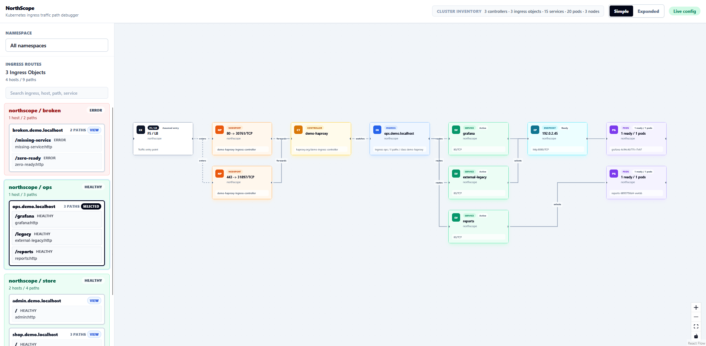

# NorthScope


**NorthScope is a lightweight, read-only Kubernetes Ingress topology debugger.**

NorthScope helps platform, SRE, DevOps, and application teams understand north-south traffic paths without changing the cluster. It watches Kubernetes API resources with read-only access, groups routes by Ingress object, and visualizes the path from external entry to controller, Ingress, Service, and backend Pods.



## Overview

Ingress debugging often means stitching together several commands:

- which controller owns this Ingress?
- which host and path matched?
- which Service and port does it route to?
- are there Ready Pods or usable endpoints?
- which Node is running the backend?

NorthScope turns that configured traffic model into a UI. The default view stays intentionally simple:

```text
F5 / LB -> NodePort if present -> Controller -> Ingress -> Service -> Pod summary
```

Expanded mode adds route, DNS/host, individual Pod, Node, EndpointSlice, and legacy Endpoint context for deeper debugging.

## Features

- Read-only Kubernetes topology discovery
- Namespace-aware Ingress route browser
- Ingress object -> host -> path grouping
- Simple and Expanded topology modes
- Route diagnostics for missing Services, missing ports, selector mismatches, no Ready Pods, missing EndpointSlice/Endpoints data, and unusable endpoints
- EndpointSlice-aware backend checks, including selector-less Services and legacy Endpoints fallback
- Optional Gateway API and F5 CIS discovery when those CRDs are installed
- Real-time updates over WebSocket
- Prometheus-compatible `/metrics` endpoint for watcher health and snapshot build status
- Single Go binary with embedded React UI
- Single container image and Helm chart

NorthScope does not require eBPF, DaemonSets, sidecars, service mesh dependencies, custom CRDs, or write permissions.

## Installation

Prerequisites:

- Kubernetes cluster
- Helm 3

Add the Helm repository:

```bash
helm repo add northscope https://emircanagac.github.io/northscope
helm repo update
```

Install NorthScope:

```bash
helm upgrade --install northscope northscope/northscope \
  --namespace northscope \
  --create-namespace
```

For reproducible installs, pin a chart version with `--version`.

Check rollout:

```bash
kubectl -n northscope rollout status deploy/northscope
```

The chart prints the access command after installation. By default, NorthScope is installed as a ClusterIP Service and can be opened with port-forwarding. To expose it through DNS, configure the chart's `ingress` values for your ingress controller and protect access with your platform's TLS and authentication controls. See [Production Access](docs/production-access.md) for concise TLS, authentication, and NetworkPolicy examples.

Production hardening options such as `networkPolicy`, `podDisruptionBudget`, resources, tolerations, and affinity are available as chart values. See `charts/northscope/values.yaml` for the full list.

For troubleshooting and operational metrics, see [Troubleshooting](docs/troubleshooting.md).

Uninstall:

```bash
helm uninstall northscope -n northscope
```

## Demo Topology

For screenshots or local UI validation, apply the optional demo topology after installing NorthScope:

```bash
kubectl apply -f https://raw.githubusercontent.com/emircanagac/northscope/main/examples/demo-topology.yaml
```

Then select the `northscope` namespace in the UI. The demo creates multiple Ingress objects, hosts, paths, Services, Pods, selector-less external endpoints, unhealthy backend examples, and placeholder ingress-controller NodePort Services.

Remove only the demo resources:

```bash
kubectl delete -f https://raw.githubusercontent.com/emircanagac/northscope/main/examples/demo-topology.yaml
```

## Architecture

```text
Kubernetes API
  |-- client-go SharedInformers
  |   |-- Ingress / IngressClass
  |   |-- Service
  |   |-- EndpointSlice / Endpoints
  |   |-- Pod
  |   `-- Node
  `-- dynamic read-only discovery
      |-- Gateway API resources
      `-- F5 CIS resources
          |
Topology Builder
          |
Go HTTP + WebSocket Server
          |
Embedded React Flow UI
```

The frontend is compiled with Vite and embedded into the Go backend using `//go:embed`, so production deployment ships as one binary inside one container.

## Security

NorthScope is intentionally observational. The default ClusterRole grants only:

```text
get, list, watch
```

It does not read Secrets, ConfigMaps, Pod logs, or Events. It does not create, patch, update, delete, exec into, or proxy through workloads. Because topology data can reveal internal hostnames, Services, Pods, Nodes, and IPs, run NorthScope behind trusted internal access controls. See [SECURITY.md](SECURITY.md) for the exact RBAC surface and [Production Access](docs/production-access.md) for TLS/auth guidance.

## Project Status

NorthScope is in pre-beta validation. The core Ingress topology workflow is usable, but the project still needs more real-cluster screenshots, installation feedback, and scenario testing before a beta release.

Recommended validation scenarios:

- one Ingress, one host, multiple paths
- one Ingress object with multiple hosts
- the same host used by different Ingress objects
- NodePort and LoadBalancer ingress controller Services
- selector-less Services with manually managed EndpointSlices or legacy Endpoints
- missing backend Service, missing Service port, and zero Ready Pods

## Development

Repository layout:

```text
.github/workflows/   GitHub Actions CI, image publishing, and chart publishing
charts/northscope/   Helm chart
cmd/northscope/      Go binary entrypoint
internal/k8s/        Kubernetes watchers, discovery, and topology building
internal/models/     Shared API and topology models
internal/server/     HTTP server, health checks, and WebSocket stream
ui/                  React UI embedded into the Go binary
```

Useful commands:

```bash
make ui-build
make build
make run
make docker
go test ./...
```

You can override defaults:

```bash
IMAGE=ghcr.io/emircanagac/northscope:dev make docker
KUBECONFIG=/path/to/kubeconfig make run
```

Release tags publish versioned artifacts. Before tagging a release, keep `charts/northscope/Chart.yaml`, `charts/northscope/values.yaml`, and `CHANGELOG.md` aligned, then push a semver tag such as `v0.1.2`. The release workflows publish `ghcr.io/emircanagac/northscope:0.1.2`, package the Helm chart, update the GitHub Pages chart repository, and create a GitHub release. NorthScope does not publish a mutable `latest` image tag.

## Community

- [Contributing](CONTRIBUTING.md)
- [Code of Conduct](CODE_OF_CONDUCT.md)
- [Maintainers](MAINTAINERS.md)
- [Security Policy](SECURITY.md)
- [Troubleshooting](docs/troubleshooting.md)
- [Changelog](CHANGELOG.md)

## License

Apache License 2.0. See [LICENSE](LICENSE).
